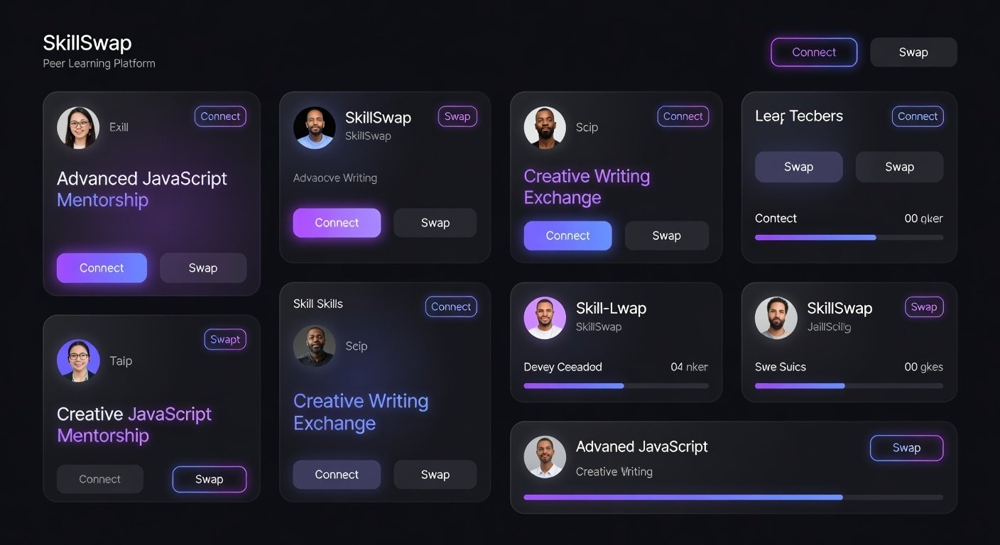

# ⚡ SkillSwap - Peer Learning Platform

A modern, AI-moderated peer-to-peer learning platform where users can both teach and learn skills through live video sessions.



## 🌟 Features

### 🔐 Authentication & Onboarding
- JWT-based authentication with localStorage
- 2-second animated splash screen on login
- Multi-step onboarding flow
- Role-based access (Learner/Teacher/Both)

### 📊 Role-Based Dashboard
- Dynamic bento-box layouts per user role
- Live statistics (active sessions, completed sessions, pending requests)
- Quick access to demo sessions
- Recent activity feed

### 🔍 Find Teachers
- Browse verified teachers with skill filters
- DiceBear avatar integration
- Teacher profiles with ratings and reviews
- 6 pre-seeded demo teachers

### 📚 Skills & Exams
- **Live Camera Proctoring** - Active monitoring during exams
- **Tab Detection** - Auto-submit after 3 violations
- **Fullscreen Enforcement** - Exam runs in fullscreen mode
- 3 Exam Types:
  - **MCQ** - Multiple choice questions
  - **Coding** - Live code editor with test cases
  - **Portfolio** - URL submission for creative skills
- 12 available skills with 8 complete exams
- Instant results with score breakdown

### 💬 Live Sessions
- **Real-time Chat** - Message exchange with typing indicators
- **Video Call Simulation** - getUserMedia integration
- **AI Moderation** - Keyword-based content filtering
- **Auto-Termination** - Session ends after 2 warnings
- Moderation warnings with visual feedback
- Partner typing indicators

### 👤 Profile & Reviews
- Base64 image upload (up to 3MB)
- Skills management (offered/wanted)
- Star ratings (1-5 stars)
- Review history
- Quick role switching

## 🛠️ Tech Stack

### Frontend
- **React 19** - UI library
- **TypeScript** - Type safety
- **React Router v6** - Client-side routing
- **Vite** - Build tool
- **Pure CSS** - Dark mode design system (no Tailwind)

### State Management
- **Context API** - Authentication state
- **localStorage** - Mock backend (sessions, messages, reviews)

### Real-time Features
- **getUserMedia** - Camera/microphone access
- **Polling** - Simulated real-time updates (1.5s interval)

### AI Features
- Keyword-based moderation
- Off-topic detection
- Inappropriate content filtering

## 📦 Installation

### Prerequisites
- Node.js 18+ 
- npm or yarn

### Setup

```bash
# Clone the repository
git clone https://github.com/YOUR_USERNAME/skillswap-platform.git
cd skillswap-platform

# Install dependencies
npm install

# Run development server
npm run dev

# Build for production
npm run build

# Preview production build
npm run preview
```

## 🚀 Quick Start

1. **Register** a new account with any role (Learner/Teacher/Both)
2. **Complete onboarding** (4-step wizard)
3. **Explore demo teachers** - Pre-seeded profiles are available
4. **Take an exam** to get verified:
   - Try JavaScript, Python, React, or Spanish exams
   - Camera will activate (required)
   - Don't switch tabs (max 3 violations)
5. **Start a demo session** - Click "⚡ Start Demo Session" on dashboard
6. **Test AI moderation** - Try sending off-topic messages (e.g., "cricket", "movie")

## 📁 Project Structure

```
skillswap/
├── public/
│   └── og.png                    # Hero image
├── src/
│   ├── components/
│   │   └── Navbar.tsx            # Navigation with notifications
│   ├── context/
│   │   └── AuthContext.tsx       # Auth state management
│   ├── data/
│   │   └── mockData.ts           # Skills, teachers, AI keywords
│   ├── pages/
│   │   ├── DashboardPage.tsx     # Role-based dashboard
│   │   ├── LoginPage.tsx         # Login with splash
│   │   ├── RegisterPage.tsx      # Registration
│   │   ├── OnboardingPage.tsx    # Multi-step onboarding
│   │   ├── ProfilePage.tsx       # Profile editing
│   │   ├── SkillsPage.tsx        # Exams with proctoring
│   │   ├── MatchPage.tsx         # Teacher discovery
│   │   ├── RequestsPage.tsx      # Request management
│   │   ├── SessionsPage.tsx      # Session list
│   │   ├── SessionPage.tsx       # Live session
│   │   └── UserProfilePage.tsx   # Public profiles
│   ├── store/
│   │   └── appStore.ts           # localStorage mock backend
│   ├── utils/
│   │   └── helpers.ts            # Utility functions
│   ├── App.tsx                   # Main app router
│   ├── main.tsx                  # Entry point
│   └── index.css                 # Dark mode design system
├── index.html
├── package.json
└── vite.config.ts
```

## 🎨 Design System

### Dark Monochrome Theme
- **Primary Background**: `#0a0a0a`
- **Cards**: `#161616`
- **Elevated**: `#1c1c1c`
- **Accent**: `#ffffff`
- **Success**: `#4ade80`
- **Warning**: `#fbbf24`
- **Danger**: `#f87171`

### Typography
- **Headings**: Space Grotesk
- **Body**: Inter

### Features
- Glassmorphism effects
- Bento-box layouts
- Smooth transitions
- Responsive design

## 🧪 Testing Features

### Test AI Moderation (SessionPage)
Send these messages to trigger moderation:
- **Off-topic**: "cricket", "movie", "party", "politics"
- **Inappropriate**: "hate", "stupid", "abuse"
- **Safe**: Any message with "code", "learn", "explain", "help"

### Test Camera Proctoring (SkillsPage)
1. Start any exam
2. Switch tabs/windows
3. Get warning (3 warnings = auto-submit)
4. Camera feed shows in bottom-right

### Test Demo Session
1. Click "⚡ Start Demo Session" on dashboard
2. Instant session with pre-seeded teacher
3. Video call works with camera/mic toggle
4. Chat with real-time updates

## 📊 Pre-Seeded Data

### Teachers (6 profiles)
- Alice Chen (MIT) - React, JavaScript, UI/UX
- Bob Smith (Stanford) - Python, Data Structures
- Charlie Davis (Berklee) - Guitar
- Diana Prince (NYU) - Graphic Design, Photography
- Priya Nair (IIT) - Mathematics, Spanish
- Marcus Lee (UCLA) - Public Speaking

### Skills (12 total)
- Programming: JavaScript, Python, React, Data Structures
- Design: Graphic Design, UI/UX
- Languages: Spanish
- Academic: Mathematics, Physics
- Creative: Guitar, Photography, Public Speaking

### Exams (8 available)
- JavaScript (Mixed: 5 MCQ + 2 Coding)
- Python (6 MCQ)
- React (5 MCQ)
- Data Structures (4 MCQ + 2 Coding)
- Graphic Design (Portfolio)
- UI/UX Design (Portfolio)
- Spanish Language (5 MCQ)
- Mathematics (5 MCQ)

## 🔒 Privacy & Security

- **Mock Backend**: All data stored in browser localStorage
- **No Real Backend**: This is a frontend-only demo
- **Camera Access**: Only used during exams (getUserMedia)
- **LocalStorage Keys**:
  - `ss_token` - Auth token
  - `ss_user` - Current user
  - `ss_users` - All registered users
  - `ss_passwords` - User passwords (demo only!)
  - `ss_sessions` - All sessions
  - `ss_msgs_{sessionId}` - Messages per session
  - `ss_requests` - Swap requests
  - `ss_results` - Exam results
  - `ss_notifs` - Notifications
  - `ss_reviews` - Reviews

## 🚧 Known Limitations (Mock Backend)

- No real Socket.io (uses polling every 1.5s)
- No real WebRTC (video is simulated)
- No persistent database (clears on browser cache clear)
- Coding exam auto-evaluation is basic
- AI moderation uses simple keyword matching
- No real authentication (anyone can register)

## 🛣️ Roadmap

- [ ] Real Socket.io backend integration
- [ ] WebRTC peer-to-peer video
- [ ] MongoDB database
- [ ] Advanced AI moderation (OpenAI API)
- [ ] Code execution sandbox for exams
- [ ] Email notifications
- [ ] Calendar scheduling
- [ ] Payment integration

## 📄 License

MIT License - feel free to use for learning/portfolio purposes

## 👨‍💻 Author

Built as a comprehensive demo of modern React architecture

## 🙏 Acknowledgments

- DiceBear for avatar API
- Google Fonts (Inter, Space Grotesk)
- WebRTC community
- React community

---

**⚡ Built with React + TypeScript + Vite**
